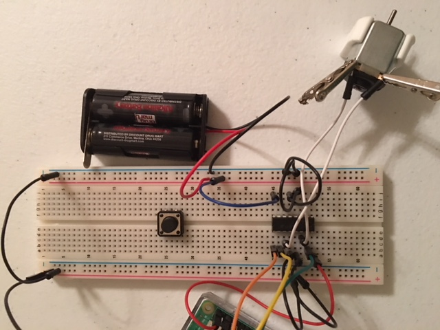

# Basic Circuit to run Motor using Python With a Raspberry Pi (40 pin)

In this demonstration, we will go over how to connect a motor to Raspberry-Pi (40 pin) and start it for 10 seconds and stop it. The purpose of this function is to remotely be able to turn on or off a motor run device, for ex. turn on the fan or garage door.

Requirements:
* Raspberry-Pi installed with Raspian: Below is version for my Raspian. 


```
$cat /etc/os-release
```

```
PRETTY_NAME="Raspbian GNU/Linux 9 (stretch)"
NAME="Raspbian GNU/Linux"
VERSION_ID="9"
VERSION="9 (stretch)"
ID=raspbian
ID_LIKE=debian
HOME_URL="http://www.raspbian.org/"
SUPPORT_URL="http://www.raspbian.org/RaspbianForums"
BUG_REPORT_URL="http://www.raspbian.org/RaspbianBugs"
```
* Python installed: Below is version of python i used

```
$python --version
```

```
Python 2.7.13
```
 
* Breadboard for connections to be made on


* An L293D motor driver chip


* Cables to connect things up


* DC motor (I used 3v and 5v DC motors)


* 2 AA Batteries


* AA Battery Connector

## How to read the Pin numbers on Raspberry-Pi and L293D Chip
### Reading Pin numbers on Raspberry-Pi 
Below is a image that shows the pin numbers of Raspberry-Pi. 


* The numbers inside the RED box is the PIN Numbers which can be used in BOARD mode.
 
```
GPIO.setmode(GPIO.BOARD)
```
* The numbers outside the RED box, for example GPIO2 or GPIO14 or GPIOx are the denotion to be used in BCM Mode. In past, these have changed with version of Raspberry Pi, so i try to use BOARD mode when possible. 

```
GPIO.setmode(GPIO.BCM)
```

### Reading Pin numbers on L293D Chip
I have gone through multiple articles and where the PIN#1 started from seemed different in different articles. After few trials and errors, i came up with the Figure#2 reference image. [And based on some other articles (one of them linked here), this looks accurate](https://elec-club-iitb.github.io/blog/2016/08/l293d/). However, this is the reference i will be using for this demonstration.


## Connections between Raspberry Pi and L293D Chip 
This should be done when Raspberry Pi is powered off to avoid any short circuits on accident.

Color Codes for cables: 
* Red: Power from PI PIN#2 
* Black: Ground 
* Green: Pi PIN#36 
* Yellow: Pi PIN#38
* Orange: Pi PIN#40
* White: Connection from L293D to Motor. PIN#3 and PIN#6 of L293D to Motor.
* Blue: Batter to L293D PIN#9


## Begin Connections


* Connect Power-in (Red Cables)
    * Raspberry Pi PIN#2 to L293D PIN#1
* Connect Ground (Black Cables)
    * We are using Raspberry Pi PIN#3
    * We are connecting ground on breadboard to the vertical connections, so we dont have to use multiple ground pins on the Pi. Instead, we could use the vertical connections. As shown in the screenshot, if the Ground is connected as shown in __1__, the whole vertical line is ground now. 
    
  Picture for above two connections are below:

  

* For easy access to the ground on the other side of breadboard, we connect the vertical line with vertical line on other side as shown in below image.


* Continue on Grounds for L293D, below are the PINS on L293D which need to be grounded. (Black Cables)
    * PIN #4, #5 
    * PIN #12, #13 
    
  

* Connect Pi's GPIO to L293D 
    * Pi PIN#36 to L293D PIN#2 (Green Cables)
    * Pi PIN#38 to L293D PIN#7 (Yellow Cables)
    * Pi PIN#40 to L293D PIN#8 (Orange Cables)
  
  Shown in below image: 
  
  

* Connect Power using AA Battery to L293D Chip
    * Connect the PIN#9 of Chip with one of the vertical connections. (Blue Cable)
    * Connect the Batteries's Positive to the vertical connection same as PIN#9's. (Blue Cable)
    * Connect the Batteries's ground to ground vertical connection. (Black Cable)
  
* Connect Motor with L293D Chip (White Cables)
    * Connect the motor with PIN#3 and PIN#6 of L293D
  
  Above 2 connections are shown in below image:
  
  
  
* Connections are all done. 


* Power up the Raspberry Pi


* Go to the directory and Run the code as: 

```
$python motor-basic.py
```

  The output on terminal should be like below: 

```
$python motor-basic.py
Turning motor on
```
 
  The motor should be running and it would run for 10 seconds and then stop.
  Final output on the terminal would be:
  
```
$python motor-basic.py
Turning motor on
Stopping motor
$
```

That's it. We got the motor running.